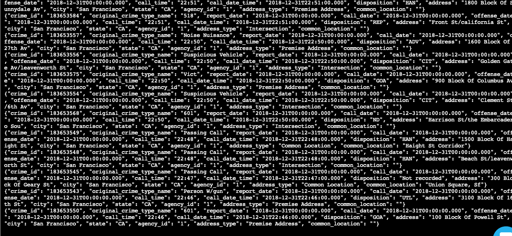
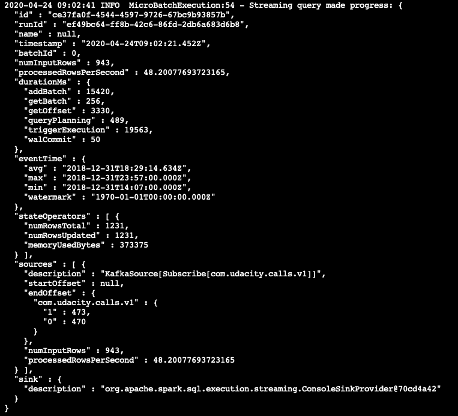
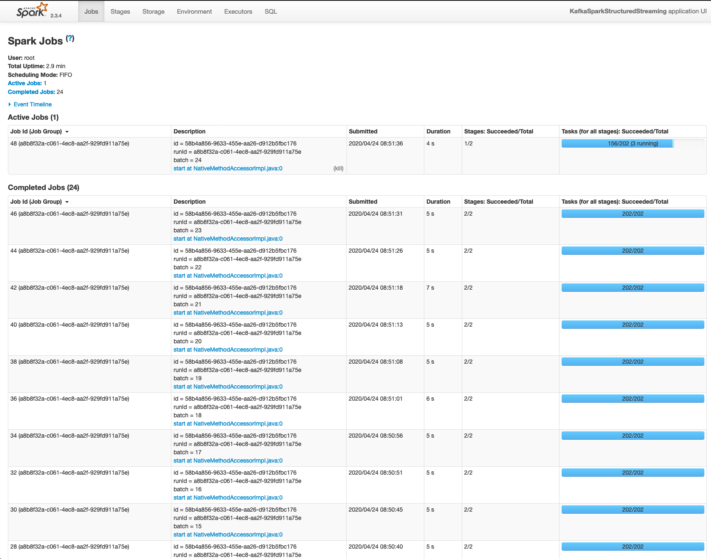

# Runbook

## Install packages
`./start.sh`

## Start Zookeeper

`/usr/bin/zookeeper-server-start config/zookeeper.properties`

## Start Kafka Server

`/usr/bin/kafka-server-start config/server.properties`

## Provide Data

`python kafka_server.py`

## Start Kafka Consumer

`kafka-console-consumer --topic "com.udacity.calls.v1" --from-beginning --bootstrap-server localhost:9092`

## Run Spark

`spark-submit --packages org.apache.spark:spark-sql-kafka-0-10_2.11:2.3.4 --master local[*] data_stream.py`

## Spark UI

# Answers

## Question: How did changing values on the SparkSession property parameters affect the throughput and latency of the data?

The metric to check is called `processedRowsPerSecond`. The documentation describes it with "The rate at which Spark is processing data".

## Question: What were the 2-3 most efficient SparkSession property key/value pairs? Through testing multiple variations on values, how can you tell these were the most optimal?

- spark.sql.shuffle.partitions: "Configures the number of partitions to use when shuffling data for joins or aggregations."
- spark.default.parallelism: "Default number of partitions in RDDs returned by transformations like join, reduceByKey, and parallelize when not set by user." - Depends on number of cores per CPU. Should be 3 per core, e.g. having 2 quad core machines the result is 24.
- spark.streaming.kafka.maxRatePerPartition: "Maximum rate (number of records per second) at which data will be read from each Kafka partition when using the new Kafka direct stream API"

To check whether the changes were most optimal the metric `processedRowsPerSecond` can be checked. The higher, the better.

References:
- [Spark Configuration](https://spark.apache.org/docs/latest/configuration.html)
- [Performance Tuning](https://spark.apache.org/docs/latest/sql-performance-tuning.html)
- ["What is the difference between spark.sql.shuffle.partitions and spark.default.parallelism?"](https://stackoverflow.com/questions/45704156/what-is-the-difference-between-spark-sql-shuffle-partitions-and-spark-default-pa)
